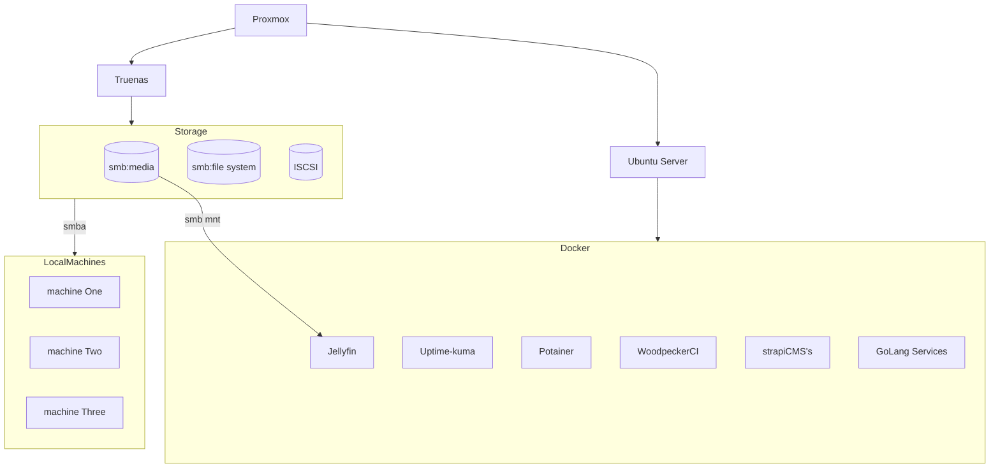

## Introduction 

I have been hacking on homelabs for a while now, more than a year less than five. This living journal is little catch for some of the things I have learned and done.

### Brief summary of my current setup

- 2015 Macbook pro running Proxmox 
  - 6T of storage RAID 4 managed with TrueNas 
  - ubuntu server 

## 2023 HomeLab Setup

### Guiding Questions 

- what is a homelab
- what is the value of a homelab(highlevel)
    - what is the value of each service

---
## Homelab Dump

### Dashboards

[Heimdall](https://heimdall.site/)
[homepage](https://gethomepage.dev/latest/)

### Hypervisors

Current choice: Proxmox

[Proxmox](https://www.proxmox.com/en/)

### DNS

- [Pi-hole](https://github.com/pi-hole/docker-pi-hole)

### Media Servers 

#### Visual 

Current Choice: Jellyfin

[Jellyfin](https://jellyfin.org/)
[Plex](https://www.plex.tv/)

### Backup Solutions 

## Objectives 

### I want to manage and host

#### General LifeStyle and Quality of Life

- media (movies, videos, shows)
- email 
- audiobook solution

#### Dev Services 

- some sort of load-balancing and cluster solution 
- local dns
- local git server?
- local ci/cd solution?
- local monitoring solution
- local logging solution
- local backup solution
- local storage solution
- local database solution
- local cache solution
- local search solution
- local AI playground 

## User Stories 

### Service Health Monitoring and Uptime

This has a couple of different parts. 

- I want checks that ensure that deps of services such as nas driver are up and running before containers spin up. 
- I want checks that ensure a service is working as expected.
- I want users(including myself) to be able to send me a message if the service is down and I want to ensure that I get that message.

If my server shuts down accidentally, I have to ssh in and remount my nas drives on my ubuntu server then restart any containers that are dependent on them. Such as jellyfin and audiobookshelf. This is extremely fragile and I need to find a more robust solution. 

###  Local and Public Network Human Readable and Rememberable Domain Names

As a user, I don't want to have to remember or look up ip addresses to get to the service I want to useCallback. I want to be able to type a domain name into my browser and have it resolve to the correct ip address.

### Service Health Monitoring

As a maintainer, I want to be able to see the health of my service at a single point and to get notifications if a service goes down.

As a maintainer, I want a clear logging solution to debug issues with my services.

## Server Env 

## Challenges 

- I want to set up a local dns so that I don't need to look up ip's each time I want to get into the various Proxmox machines I have running.

### Local DNS 

From my research their seem to be two options. 

- [Pi-hole](https://github.com/pi-hole/docker-pi-hole)
- [Adguard dns](https://adguard-dns.io/en/public-dns.html)
- [Unbound](https://nlnetlabs.nl/projects/unbound/about/)
- [Dnsmasq](https://thekelleys.org.uk/dnsmasq/doc.html)
- [Bind](https://docs.pi-hole.net/guides/dns/unbound/)
- [CoreDNS](https://coredns.io/)
- [Knot](https://www.knot-dns.cz/)
- [PowerDNS](https://www.powerdns.com/)

## Media 

### Moives, Shows, Other 

### Audiobooks

