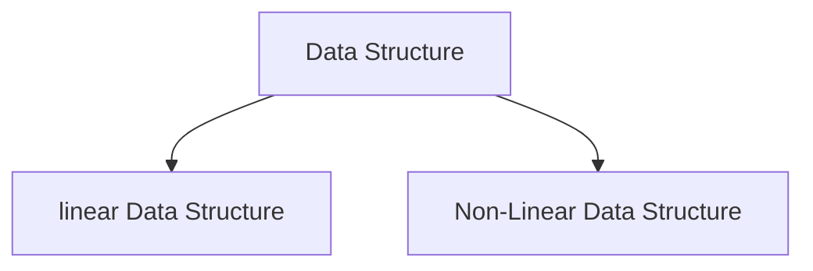
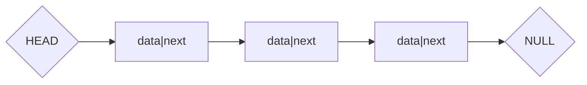

Data Structure is a collection of data that is organized for easy processing.

## Characteristics of data structures

linear
: Data that has a sequential relationship or mapping.

non-linear
: Data that do not have a sequential relationship
: example - c++ `int values[3];`

static
: Collection of data that is fixed in size at complilation time and cannot be resized.
: example - static array c++ `int values[3];`

dynamic
: Collection of data in memory that can grow or shrink in size.
: example - python list `items = [1,2,3]`

## Common Data Structures

- stack
- heap
- queue
- event loop
- linked list
- doubly linked list

### Stack

[Stack - wikipedia](<https://en.wikipedia.org/wiki/Stack_(abstract_data_type)>)

The stack is an ordered data structure. That keeps track of the functions that have been invoked. The stack is modified when a function is invoked.

When a function is invoked the details are saved to the top of the stack. (pushed to the top)

When a function is returned the information is taken off the top of the stack. (popped of the top)

**The STACK is processed top to bottom**

Stack is a [LIFO(last in fist out)](https://en.wikipedia.org/wiki/FIFO_and_LIFO_accounting) structure

### Heap

The area in memory where data is stored.

### The Queue

The queue is an ordered list of functions waiting to be placed on the stack.
_First in first out (FIFO)_

### The Event loop

Functionality in the JavaScript runtime that checks the queue when the stack is empty. If the stack is empty, the front of the queue is placed in the stack.

### [Linked List](https://en.wikipedia.org/wiki/Linked_list)

Collection of items, in nodes which points to the next element in the list.
**Benefit**

- insert data at any point
- can increase of decrease the size with relative efficiency.

**Key Terms**
**head**: beginning of a linked list
**tail**: end of a linked list
**NULL**: last node

<!--
TODO: review for enhance link list graph option
or just make figma diagram?

-->

[Singly linked list](https://en.wikipedia.org/wiki/Linked_list#Singly_linked_list)
A singly linked list does not contain a pointer to the previous node in the list.
