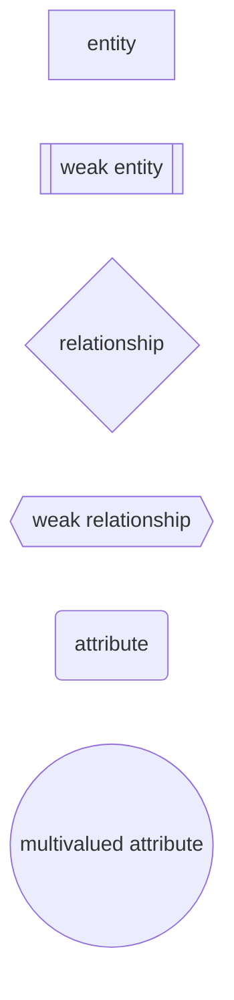
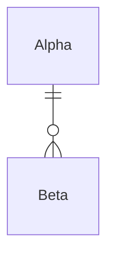

## Syntax and Conventions

A convention for entity relationship diagrams.

Rectangles: This Entity Relationship Diagram symbol represents entity types
Ellipses : Symbol represent attributes
Diamonds: This symbol represents relationship types
Lines: It links attributes to entity types and entity types with other relationship types
Primary key: attributes are underlined
Double Ellipses: Represent multi-valued attributes



## Relationship Cardinality 

One-to-One Relationships
One-to-Many Relationships
May to One Relationships
Many-to-Many Relationships


### Mandatory One or Required One to Required One


### Required One to Optional One 


### Required one to Required Many 


### Required one to Optional Many 



### Required one to Optional Many 


```mermaid 

    id3[entity]
    id4[[weak entity]]
    id1{relationship}
    id5{{weak relationship}}
    id2(attribute)
    id6((multivalued attribute))

```


## Reference 

### Mermaid Syntax Cheatsheet

possible cardinalities.

| Value (left) |	Value (right) |	Meaning |
| --- | ---| ----|
| `|o` |	`o|` | 	Zero or one |
| `\||`|	`\||`	| Exactly one |
| `}o` | `o{` | Zero or more (no upper limit) |    |                              |
| `}\|`    |           `\|{` | One or more (no upper limit) |

### Tools 

- [Mermaid Live](https://mermaid.live)

In general, I think mermaid should be used first and formost if the readability can be maintained.

