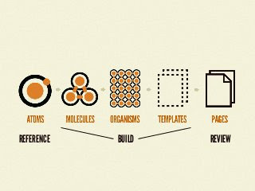

# Design Resources 2022

- [Design Resources 2022](#design-resources-2022)
  - [Resources](#resources)
  - [Atomic Design](#atomic-design)
    - [UX](#ux)
    - [Accessability](#accessability)
    - [Inspiration](#inspiration)
  - [User Research and Feedback](#user-research-and-feedback)
    - [Color](#color)
      - [Inspiration](#inspiration-1)
      - [Tools](#tools)
    - [Typography](#typography)
      - [Foundries](#foundries)
    - [Video](#video)
      - [Resource](#resource)
    - [Logo/Mark](#logomark)
      - [Tools](#tools-1)
    - [Image](#image)
    - [Tools](#tools-2)
    - [Design Systems / Webkits](#design-systems--webkits)
    - [Iconography](#iconography)
    - [References](#references)
    - [Other](#other)

## Resources

## Atomic Design

[Atomic Design Manifesto](https://atomicdesign.bradfrost.com/)

### UX

- [Laws of UX](https://lawsofux.com)
- [Real World Design Patterns](https://www.uisources.com/interactions)
- [Coglode - UX behavioral insight](http://coglode.com)

### Accessability

- [Color Contract checker ](https://coolors.co/contrast-checker/dcdcdc-545f50)

### Inspiration

**[Owwly](https://owwly.com/products/newest)**
Curated list of upcoming and stand out projects. Good place to see emerging bleeding edge design trend.

- [DesignInpiration](http://designspiration.net)
- [Awwwards](https://www.awwwards.com)
- [typewolf](https://www.typewolf.com/)
- [land book](https://land-book.com/)

## User Research and Feedback

- [Emojics](http://www.emojics.com/)

### Color

#### Inspiration

- [Gradients - with css](https://gradients.cssgears.com)
- [ColorWise - color pallets](https://colorwise.io/)
- [ColorHunt - color pallets](http://www.colorhunt.co)
- [ColorSupply - pallete maker ](http://colorsupplyyy.com/app)
- [Color picker - MDN](https://developer.mozilla.org/en-US/docs/Web/CSS/CSS_Colors/Color_picker_tool)
- [htmlcoloCodes - dev friendly color](https://htmlcolorcodes.com/color-picker)
- [Adobe Pallet Maker](https://color.adobe.com/create)
- [AI pallets Maker](http://colormind.io)
- [Color and Fonts](https://www.colorsandfonts.com)
- [Happy Hues - pallets and example ui](https://www.happyhues.co)

#### Tools

- [Sipp - pallete manager](http://sipapp.io/#!)
-

### Typography

- [TypeScale](http://type-scale.com)
- [Practical Typography](https://practicaltypography.com/point-size.html)

#### Foundries

- [Font Share](https://www.fontshare.com/)
- [Open Foundry](https://open-foundry.com/fonts)
- [Uncut](https://uncut.wtf/)
- [Love Letters](http://www.love-letters.be/foundry.html)
- [Velvetyne](http://velvetyne.fr/)
- [Tunera](http://www.tunera.xyz/)

### Video

#### Resource

- [mixkit - free assets](https://mixkit.co/)

### Logo/Mark

#### Tools

- [Dotgrid - logo maker tool](https://hundredrabbits.itch.io/dotgrid)
- [Curated Logo List](http://www.thelogofactory.com)

### Image

### Tools

- [AI image enhancement](https://icons8.com/upscaler)

### Design Systems / Webkits

- [Design System checklist](https://www.designsystemchecklist.com)

### Iconography

- [The Noun project ](https://thenounproject.com)

### References

- [Raphael Bastinde Font Foundry List](https://gitlab.com/raphaelbastide/libre-foundries)

### Other

- [Meta tag previewer](https://metatags.io/)
- [Graphic design terms](https://www.canva.com/learn/graphic-design-terms)
- [blobmaker](https://www.blobmaker.app)
