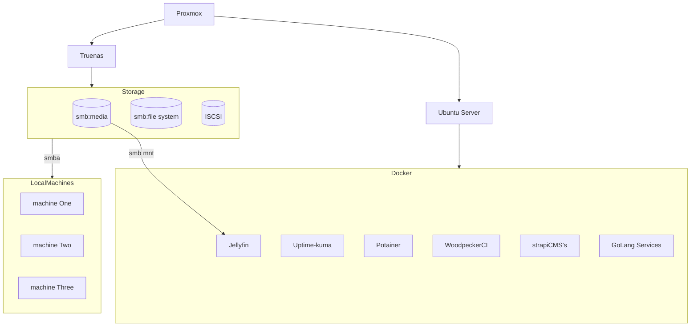

## Self Hosted Picks 

-  [dashy](https://dashy.to/)
The Ultimate Homepage for your Homelab

## 2023 HomeLab Setup

```mermaid 
graph TB
	a[Proxmox]-->b[Truenas]
	a-->c[Ubuntu Server]
	c-->subA
	b-->subB
	subB -- "smba" -->subC
	subgraph subA[Docker]
		direction LR
		d[Jellyfin]
		e[Uptime-kuma]
		f[Potainer]
		g[WoodpeckerCI]
		h[strapiCMS's]
		i[Node Services]
		i[GoLang Services]
	end
	subgraph subB[Storage]
		direction RL
		j[(smb:media)]
		k[(smb:file system)]
		l[(ISCSI)]
	end
	subgraph subC[LocalMachines]
		m[machine One]
		n[machine Two]
		o[machine Three]
	end

	j-- "smb mnt"-->d
	
```