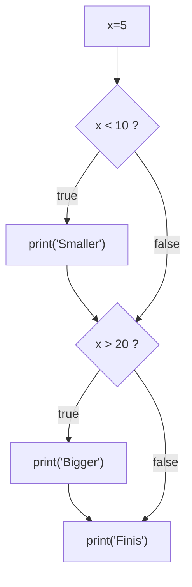
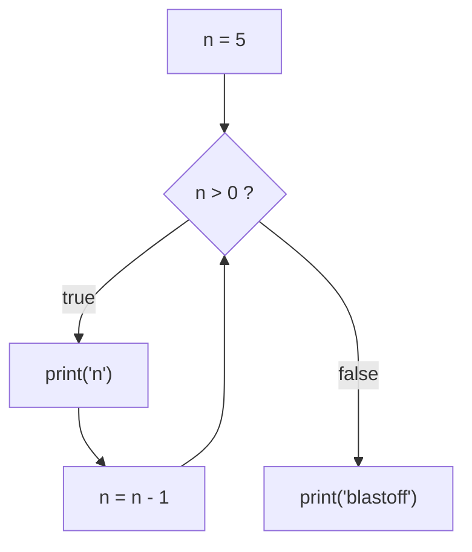
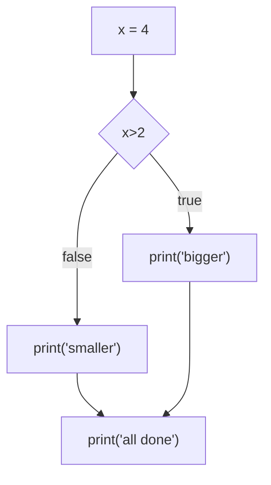
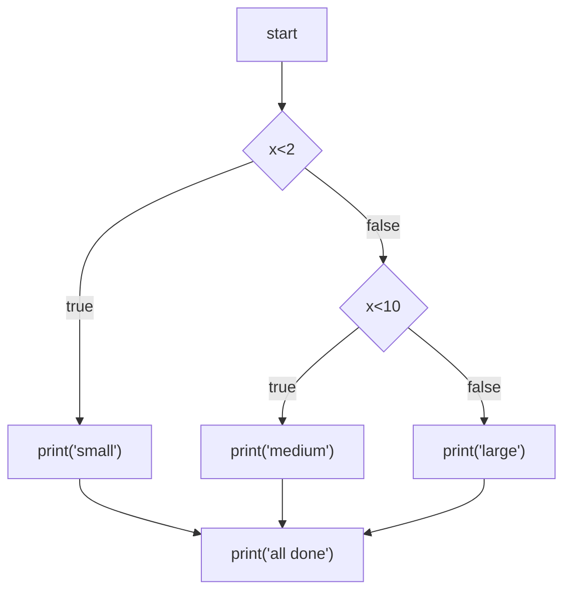
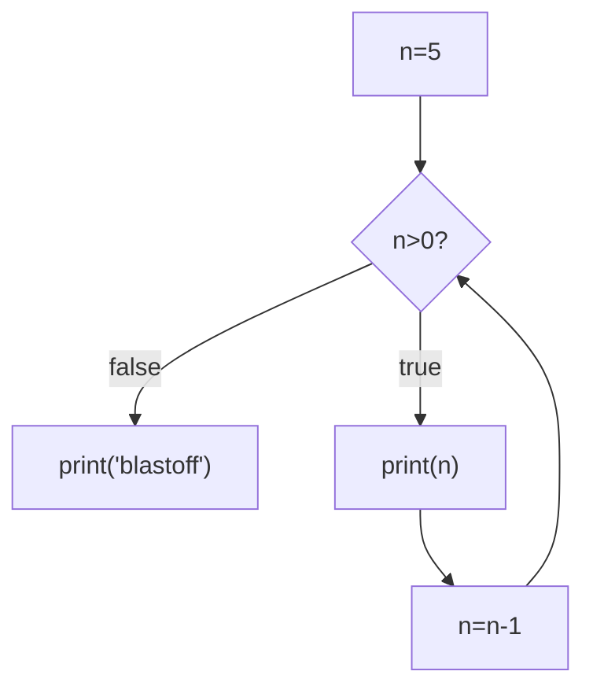
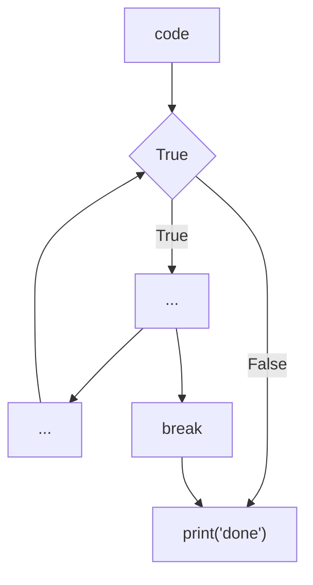
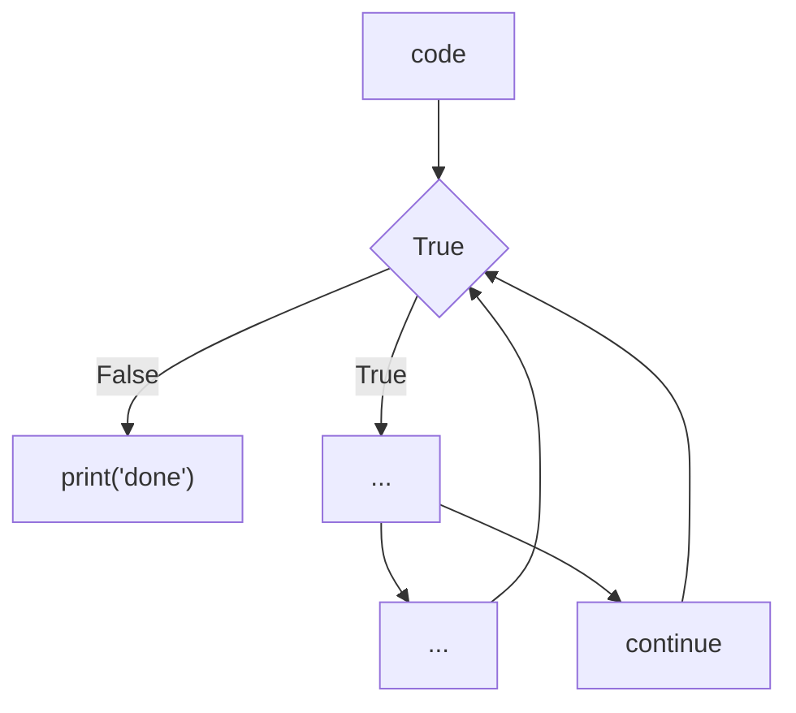
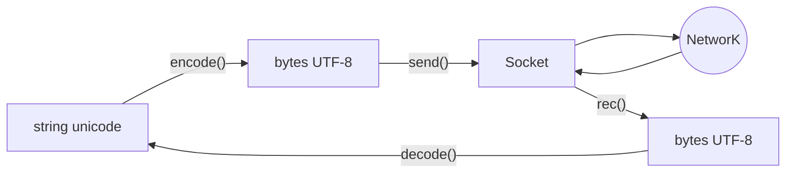
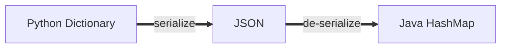
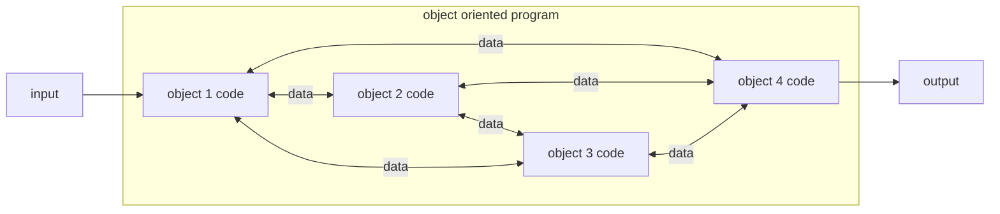

## Help

From the python CLI env we can use ```>>> help()``` then a python method or keyword to get the documentation. 

```sh
>>> help()
help> for
# outputs the python documentation for `for`
```

### `dir(<object>)`
Dir on an object will list out the available methods as a quick reference. 

## Hardware Architecture 

__Basic Computer Hardware__ 

- input and output 
- central processing unit 
- main memory (fast)
- secondary memory 

cpu asks what is next and from main memory 

Main memory requires constant power, so to meet the need for persistence memory the secondary storage is used to store a position without power. 

### History 

Python was named for Monty Python Flying Circus

### Basic Syntax 

__Reserved Words__

Word within python that have predefined meaning and therefore cannot be redefined. 

|        |        |        |        |          |
| :----- | :----- | :----- | :----- | :------- |
| False  | class  | return | is     | finally  |
| None   | if     | for    | lambda | continue |
| True   | def    | from   | while  | nonlocal |
| and    | del    | global | not    | with     |
| as     | elif   | try    | or     | yield    |
| assert | else   | import | pass   |          |
| break  | except | in     | raise  |          |


```python
x = 2 # assignment statement 
x = x + 2 # assignment width expressions 
print(x) # print statement 
```


*A set of code within a .py file is called a script* 

### Basic Patterns 

__Sequence__
: A recipe or instructions done in order

__Conditional__
: Set of steps that are done when a certain condition is met 

__Repeated__
: An instruction or group of instructions that are done again and again


#### Example - Simple Sequence 

```python
x = 2 
print(x) # >> 2 
x = x + 2 
print(x) # >> 4
```

#### Example - Simple Conditional  

```python 
x = 5 

if x < 10:
	print('smaller')
if x > 20: 
	print('Bigger')

print('Finis)
```
__Flow diagram of conditional__



#### Example - Repeated Step (loop)

```python 
n = 5

while n > 0: 
	print(n)
	n = n - 1 

print('blastoff')
```

__Flow diagram of loop__



### Chapter 2 - Variables, Expressions, and Statements

### Constants 

__Constants__
: fixed values such as numbers, letter, and strings

__Example -Constants__

```python 
print('abc')
print(123)
```

### Variables 

__Variable__
: A variable is a named place in the memory where a piece of data is stored and can later be retrieved using the variables name

__Example - Variable__

```python 
x = 12.2
y = 15
```

#### Variable Naming Convention 

- must start with letters or underscore 
- must consist of letters, number, and or underscores
- case sensitive 

| Good   | Bad    | Different |
| :----- | :----- | :-------- |
| spam   | 23spam | spam      |
| eggs   | #sign  | Spam      |
| spam23 | var.12 | SPAM      |
| _speed |        |           |

Mnemonic
: memory aid 

__Example - Bad Naming__

```python 
x1qrty = 35.0 
x1qrtz = 12.5
x2qrty = x1qrty * x1qrtz
print(x2qrty)
```

- confusing 
- hard to keep track of 
- easy to make mistakes 
  
__Example - Convenient Naming__

```python 
x = 35.0 
y = 12.5
z = x * y
print(z)
```

- quick 
- relatively easy to keep track of 
  
__Example - Mnemonic Naming__

```python 
hours = 35.0 
rate = 12.5
pay = hours * rate
print(pay)
```

- easy to follow and understand code 

#### Complex Variable Assignment 

```python 
# this is a valid assignment 
y = 2.5
x = 3.9 * y * (1 - y )
```

### Expressions 

#### Operators 

| Operator | Operation           |
| :------: | :-----------------: |
| +        | Addition            |
| -        | Subtraction         |
| *        | Multiplication      |
| /        | Division            |
| **       | Power               |
| %        | Remainder or modula |

__PEMDAS__

__P__ parenthesis
__E__ exponential 
__M__ multiplication 
__D__ division 
__A__ addition 
__S__ subtraction

#### Types

Variables, literals, and constants have __types__

Python applies different operations for different operators depending on the type. For example the "+" operator applied on type int will result in addition. 

__Example - Addition__

```python 
a = 1 + 4 
print(a)
# 5
```

 In contrast the when the "+" operator is applied on type string the result is concatenation. 

 __Example - String Concatenation__

 ```python 
test = "big" + "sky"
print(test)
# big sky
 ```

Applying an operator on two different type results in;

```python 
Traceback (most recent call last):
File "<stdin>", line 1, in 
<module>TypeError: Can't convert 
'int' object to str implicitly
```

##### `type()` - check types

```python 
x = 1
type(x)
# <class 'int'>
temp = 185.9
type(temp)
# <class 'float'>
```

#### Type Conversions 

##### `float()` 

```python 
print(float(99))
# 99.0
```

##### `int()`

```python 
print(int(99))
# 99
```

#### Integer Division 

In python3 integer division returns a float 

__Example - Integer Division__

```python 
print(10/2)
# 5.0
print(9/2)
# 4.5 
```

#### String Conversion

We can use `int()` and `float()` to convert between strings and integers. 

__Example - String Conversion__

```python
temp0 = '1859'
print(type(temp0))
# <class 'str'>
temp1 = int(temp0)
print(type(temp1))
# <class 'int'>
temp2 = float(temp0)
print(type(temp2))
# <class 'float'>
```

#### User Input 

Python can accept input from the user via the `input()` function. 

__Exmaple - user input__

```python 
name = input('What is your name? ")
print('welcome ', name)
```

### Conditionals 

__Example - if conditional__

```python
x = 5
if x < 10: 
	print('smaller ', x )
print('bigger', x)
```

Conditional use logical operators to determine if a statement is true of false 

#### Comparison Operators

| operator | definition               |
| :------- | :----------------------- |
| <        | less than                |
| <=       | less than and equal to   |
| ==       | equal to                 |
| >=       | greater than or equal to |
| >        | greater than             |
| !=       | not equal                |

__Example - operators__

```python 
x = 5 
if x == 5: 
	print('equal 5')
if x > 4: 
	print('greater than 4')
if x >= 5: 
	print('greater than or equal to 5' )
if x < 6:
	print('less than 6')
if x <= 5: 
	print('less than or equal 5')
if x != 6: 
	print('not equal 6')
```

### Indentation 

Indentation is a syntactical component of python, this means that it is required and for the language to run. Where as in other popular languages indentation is a strong recommendation for readability.

__Example - Python Indentation__

```python
x = 5
if x > 2:
	print('bigger than 2')
	print('still bigger')
# end if block
print('done with if greater than 2 block')

for i in range(5):
	print(i)
	if i > 2: 
		print('bigger than 2')
	# end if block in for loop
	print('done with i', i)
# end for loop block
print('all done')
```

#### Two way decisions - if else

```python 
x = 4
if x > 2: 
	print('bigger')
else: 
	print('smaller')
print('all done')
```



#### Multi way decisions 

```python 
if x < 2: 
	print('small')
elif x < 10:
	print('medium)
else: 
	print('large')
print('all done')
```


#### The try/except structure 

Note: Python requires the try except to be applied a bit more than other languages because of its conservative nature. Therefore, to ensure that our code fully runs we use the try except.

__Example - Try Except__

```python
astr = 'hello bob'
try: 
	istr = int(astr)
	# fails therefore, drops into except
except: 
	istr = -1
print('first', istr)# 
# first -1

astr = '123'
try: 
	istr = int(astr)
except: 
	istr = -1
print('second', istr)
# second 123
```

__Example - Try Except user input__

```python 
rawstr = input('Enter a number: ')
try: 
	ival = int(rawstr)
except: 
	inval = -1 

if ival > 0: 
	print('Nice work')
else: 
	print('Not a number')
```

### Functions 

A function has two parts. The first is the defining and the second is the invoking.
In python defining the function is defined by `def` keyword followed by the function name, `def myFunction()` then said function can be called after by invoking its name `myFunction()`.

__Example - function__

```python
# defining a function
def thing():
	print('hello)
	print('fun')

# invoking a function
thing()
```

```python
big = max('hello world')
print(big)
# w
```
#### Parameters 

A __parameter__ is a variable which is passed into a function definition to be used in said function thereby making said function more dynamic and expanding utility. In the invoking of a function the __argument__.

##### Multiple Parameters 

```python
def addtwo(a,b):
	return a + b

x = addtwo(3,5)
print(x)
# 8
```

#### Return statement

The `return` statement causes the execution of a the running function to end. The `return` can also be used to passed a return value to the code that called the function.

```python
def greet():
	return "hello"

print(greet())
# hello
```
Functions that return values are called "fruitful" because the produce a value or result.

### Loops and Iteration 

Loops enable computers to do things many times. Loops use __iteration variables__ to keep track of when to start and when to stop. 

```python 
n = 5
while n > 0: 
	print(n)
	n = n - 1
print('blastoff!)
print(n)
```



#### Loops Control Statements

Loop controls statements change execution from its normal sequence. Loop control statements can be used to skip, ignore conditions. The Python language contains `coninue`,`break`, and, `pass`.

#### `break`

The __break__ statement ends the current loop. Whatever else is written in the loop no longer runs. 



#### `continue`

The __continue__ statement ends the current iteration and jumps to the top of the loop.

```python 
for i in range(1, 11):
	if i == 6: 
		continue
	else:
		print(i, end = " ")
```



__Indefinite Loops__
: While loops are called __indefinite loops__ because the keep going until a logical condition becomes false.

__Definite Loops__
: Definite loops loop through a finite list.

```python
for i in [5,4,3,2,1]:
	print(i)
print('blastoff')
```

#### `None`

The `None` type is nothing type. 
__Example - none type__

```python
smallest = None
for value in [9, 11, 12, 3, 74, 15]:
	if smallest is None: 
		smallest = value
	elif value < smallest: 
		smallest = value
	print(smallest, value)
```

> `is` and `is not` operators require equality in type and value; for example
> 0 == 0.0 >> true and 0 is 0.0 >> false. We can say that `is` is a stronger comparison operator. 

### Strings - Chapter 6 

- a string is a sequence of characters 
- strings can contain numbers 
- strings are indexed and therefore any value in a given string can be accessed by its index

__Example - string index__

```python 
fruit = 'banana'
letter = fruit[1]
print(letter)
>> a
```

##### `len()` 

```python 
fruit = 'banana'
x = len(fruit)
print(x)
6
```

#### Looping Through Strings

__Example - while loop__

```python 
fruit = 'banana'
index = 0
while index < len(fruit):
	letter = fruit[index]
	print(index, letter)
	index = index + 1
```

__Example - for loop__
```python 
fruit = 'banana'
for letter in fruit: 
	print(letter)
```

#### Slicing Strings 

Slice uses a bracket notation [<initial_value>:<up_to_value>]

__Example - slicing__
```python
s = 'monty python'
print(s[0:4])
# mont
print(s[6:7])
# p
```

```python 
s = 'monty python'
# no initial value assumes beginning of string
print(s[:2])
# mo
##
# no ending value assumes end of string
print(s[8:])
# thon
```

#### `in` as a string logical operator 

```python 
fruit = 'banana'
'n' in fruit
# True
'm' in fruit
# False
if 'a' in fruit: 
	print('found it')
# found it
```

### String Library

See a list of methods for a given object run `dir(<object>)`; example `dir('string')`, `dir(4)`

__Common String Methods__

`str.lower()` 
`str.capitalize()`
`str.center(width[, fillchar])`
`str.endswith()`
`str.find(sub[, start[, end]])`
`str.lstrip([chars])`
`str.replace(old, new[, count])`
`str.lower()`
`str.rstrip([chars])`
`str.strip([chars])`
`str.upper()`


```python 
greet = 'Hello World'
low = greet.lower()
print(low)
# hello world
```

#### `find()`

returns a the index for the first instance of a given substring 

#### `replace()`
returns a string with all of a given char replaced with another char

#### Stripping Whitespace

`lstrip()` remove whitespace from left
`rstrip()` remove whitespace from right
`strip()` remove whitespace from beginning and ending

### Reading Files - chapter 7

Python uses `open()` to return a variable that can then be use to perform operations on. 

```python 
file_object = open(<file_name>,<access_mode>)
```

```python 
handle = open('mrfile.txt', 'r')
# open file for reading
```

##### `\n`
: newline character is an encoding that represents a newline in a set of chars. The newline its self is a char. 
: the newline char is part the whitespace set

__Example - new line__

```python 
x = 'hello\nworld'
print(x)
# hello
# world
y = `a\nb`
print(len(y))
# 3
````
##### File Handle as a Sequence

A file handle can be treated as a sequence of string where each line in the file is a value in the sequence thus we can do;

__Example  - print line in file__

```python 
file = open('file.txt')
for line in file: 
	print(line)
# this would print of each line in the file 
```

__Example  - Count Number of Lines in File__

```python 
count = 0
file = open('file.txt')
for line in file: 
	count = count + 1
print(count, 'lines in file')
```

#### `read()` - used to read a file as a single string

```python
fhand = open('file.txt')
read = fhand.read()
print(len(read))
# chars in file
```

__Example - Simple search__

```python 
# pattern 1
fhand = open('file.txt')
for line in fhand: 
	if line.startswith('The'):
		print(line.strip())
# print all lines that begin with the. 
```

```python 
# pattern 2
fhand = open('file.txt')
for line in fhand: 
	if line.startswith('The'):
		continue
	print(line.strip())
# print all lines that begin with the. 
```

__Example - Simple File Search__

```python
fname = input('Enter the file name: ')
try: 
	fhand = open(fname)
excerpt:
	print('File cannot be opened: ', fname)
	# we add a quit ensure the program exist gracefully 
	# as the variable fhand is undefined in the code below
	quit()

count = 0
for line in fhand:
	if line.startswith('Subject:'):
		count = count + 1
print('There were', count, 'subject lines in', fname)
```

### Python List Data Structures - Chapter 8

__Algorithms__
: a set of rules or steps to solve a problem

__Data Structures__
: a particular way of organizing data in a computer

__Example - lists__

```python
[1, 24,76]
['red', 'yellow', 'green']
[2,'red']
```


__Strings vs Lists__

strings are __immutable__, a strings contents cannot be changed. To change a string a new variable needs to be assigned with the transformations applied. 

lists are __mutable__, a element can be accessed via index and a method can be applied or the value can be reassigned. 

list have positions or indexes

#### `range()`

#### Looping through Ranges 

```python 
colors = ['red', 'yellow','green', 'blue']
for i in range(len(colors)):
	print(colors[i], i)

# get color value and index
```

#### Concatenate List 

```python
a = [1,2,3]
b = [4,5,6]
print(a+b)
[1,2,3,4,5,6]
c = a + b
print(c)
[1,2,3,4,5,6]
```

#### Slicing List 

```python
t = [9,41, 12,3,74,15]
t[1:3]
# [41,12]
```

#### Empty or Initializing List 

```python 
list_a = []
print(len(list_a))
# 0

# constructor 
list_b = list()
print(len(list_b))
# 0
```

#### `in` operator

```python
some = [1,2,3,5,9]
9 in some 
# True
```

#### `sort()` method 

> Note: sort is dependent on type and will return a trace back

If both uppercase and lowercase exist uppercase is before lowercase.

```python
word = ['big','Big', 'med','Medium']
word.sort()
print(word)
# ['Big', 'Medium', 'big', 'med']
```

Python has built in methods for manipulating list as well builtin functions that work with list.

#### `split()` - !important!
Split breaks a string on a separator.

```python
line = 'first;second;third'
list = line.split(';')
print(list)
# ['first','second','third']
```

### Python Dictionaries - chapter 9

list
: a linear collection of values that stays in order

dictionary
: a collection of values each with their own label
: associative arrays 
: order is not maintained 
: keys are unique

##### Example - Counting Frequency

```python
colors = ['blue','red','blue','red','green','blue','blue','red','green']
color_count = dict()

for c in colors: 
	if c not in color_count:
		color_count[c] =  1
	else: 
		color_count[c] = color_count[c] + 1

print(color_count)
```

__`get` - Counting Frequency Pattern__
`.get(key[, default])` 
: return value of key if key is in the dictionary, else default. If default is not given, defaults to `None`

```python
colors = ['blue','red','blue','red','green','blue','blue','red','green']
color_count = dict()

for c in colors: 
	color_count[c] = color_count.get(c, 0) + 1	

print(color_count)
```

#### Looping Through Dictionaries

```python
names = {'Alfhid':'Battle of elves', 'Asger':'Spear of God', 'Asmund':'Divine Protection', "Canute":"knot" }

for name in names: 
	print(name, '-' names[name])

```

##### Extract Keys and Values 

##### Data
```python
# viking names
names = {'Alfhid':'Battle of elves', 'Asger':'Spear of God', 'Asmund':'Divine Protection', "Canute":"knot" }
```


```python
print(list(names))
# ['Alfhid', 'Asger', 'Asmund', 'Canute']
```

##### Keys
```python
print(names.keys())
# dict_keys(['Alfhid', 'Asger', 'Asmund', 'Canute'])
```
##### Values
```python
print(names.values())
# dict_values(['Battle of elves', 'Spear of God', 'Divine Protection', 'knot'])
```
##### Items
Outputs sets of tuples

```python
print(names.items())
# dict_items([('Alfhid', 'Battle of elves'), ('Asger', 'Spear of God'), ('Asmund', 'Divine Protection'), ('Canute', 'knot')])
```

##### Tuple Pattern 

```python
# key, value
for name,meaning in names.items():
	print(name, '-' meaning)

# Alfhid - Battle of elves
# Asger - Spear of God
# Asmund - Divine Protection
# Canute - knot
```


__Example - Count Words in File__

```python
file = input('file.txt')
handle = open(file)

count_words = dict()
for line in handle: 
	words = line.split()
	for word in words:
		# check if key exists in dict and if not default to 0
		count_words[word] = count_words.get(word, 0) + 1

greatest_word = None
greatest_count = None
for word, count in count_words.items():
	if greatest_count is None or count > greatest_count:
		greatest_word = word
		greatest_count = count

print(greatest_word, greatest_count)
```

### Tuples - Chapter 10 

- more efficient for data structures that do not need to be mutated
- - __tuples are immutable__
- maintain order
- take less storage
- quicker access

```python
# egyptian names 
egy_names = ('Abayomi', 'Bomani', 'Tau', 'Thema')
```
__Example - Tuple Error__

```python
z = (5,4,2)
z[2] = 3
# Traceback: 'tuple' object does not support item assignment
```

Because tuples are immutable list methods that have to do with reordering or modifies not available on tuples; `.sort()`, `.append()`, and, `.reverse()`.

__CLI Environment Check__

```python
>>> dir(list())
# [...'append', 'clear', 'copy', 'count', 'extend', 'index', 'insert', 'pop', 'remove', 'reverse', 'sort']]
```

```python
>>> dir(tuple())
#  ['count', 'index']
```

#### Tuple Assignment 

```python 
(x, y) = ('green','blue')
print(y)
# blue
```

#### Tuple Comparison

Tuples can be compared via `==`, `<`,`>`, but they are only compared to the first difference. 

```python
# a: 097 and g : 103 ascii codes
('g', 100) > ('a', -50)
# true
```

```python
d = {'a':10,'c':22,'b':1}
d.items()
# dict_items([('a', 10), ('c', 22),('b', 1)])
sorted(d.items())
# [('a', 10), ('b', 1), ('c', 22)]
```

#### Pattern - Sort Dictionary By Key

```python
# norwegian names
norw_names = {'Udom': 'principled', 'Uffe': 'wolf man', 'Obasi':"in god's honor",'Fahim':'scholar, learned man', 'Aaliyah':'exalted, sublime','Abbe':'nobelman'}

for k, v in sorted(norw_names.items()):
	print(k,v)

# Aaliyah exalted, sublime
# Abbe nobelman
# Fahim scholar, learned man
# Obasi in god's honor
# Udom principled
# Uffe wolf man
```

#### Pattern - Sort Dictionary By Values

```python
x = {'a':10,'b':1,'c':22}
tmp = list()
for k,v in x.items():
	tmp.append((v,k))

print(tmp)
# [(10, 'a'), (1, 'b'), (22, 'c')]

tmp = sorted(tmp, reverse=True)
print(tmp)
# [(22, 'c'), (10, 'a'), (1, 'b')]
```

__Example - Count Words in File Pattern II__

```python
file = input('file.txt')
handle = open(file)

c = dict()
for line in handle: 
	words = line.split()
	for word in words:
		# check if key exists in dict and if not default to 0
		c[word] = c.get(word, 0) + 1

# create a new list of tuples in value key order
lst = list()
for key, val in c.items():
	newtup = (val, key)
	lst.append(newtup)

lst = sorted(lst, reverse=True)

for val, key in lst[:10]:
	# prints out vertically the top 10 most used words
	print(key, val)
```

__Example - List Comprehension__

```python
lst = list()
for k, v in c.items():
	lst.append((v,k))

lst = sorted(lst, reverse=True)
```
these two code blocks are equivalent
```python
print( sorted([ (v, k ) for k, v in c.items() ]), reverse=True)
```

## Regular Expressions - Chapter 11

__Regular Expression__
: is a sequence of characters that define a search pattern. 

### Regular Expression Cheat sheet 
| regex symbol | definition                                            |
| ------------ | ----------------------------------------------------- |
| `^`          | matches the beginning of a line                       |
| `$`          | matches the end of the line                           |
| `.`          | matches any character                                 |
| `\s`         | matches whitespace                                    |
| `\S`         | matches any non-whitespace character                  |
| `*`          | repeats a character zero or more times                |
| `*?`         | repeats a character zero more more times (non-greedy) |
| `+`          | repeats a character one or more times                 |
| `+?`         | repeats a character one or more times (non-greedy)    |
| `[aeiou]`    | matches a single character in the listed set          |
| `[^XYZ]`     | matches a single character not in the listed set      |
| `[a-z0-9]`   | the set of characters can include a range             |
| `(`          | indicated where string extraction is to start         |
| `)`          | indicated where string extraction is to end           |
| `\`          | escape special characters `\$` for semantic $         |


### Using Regex in Python 

Regular expression is a module in python and therefore needs to be imported via `import re`

```python 
import re

# search returns True/False regular expressions string matches 
re.search()

# findall return a list of all the strings that match
re.findall()
```

### Greedy Matching 

Greedy matching means that for given string that contains a defined pattern multiple times the `re.findall()` will return the larger of the matches. 

__Example - Greedy Matching__

```python
import re

x = 'From: Using the : character'
y = re.findall(`^F.+:`, x)
print(y)
# [From: Using the :]
```

### Non-Greedy Matching 

```python
import re

x = 'From: Using the : character'
y = re.findall(`^F.+?:`, x)
print(y)
# [From:]
```

__Example - Regex: Get Email Domain__

```python
import re

line = "test@test.com, example@example.com"
y = re.findall('@([^ ]*)', line)
print(y)
# ['test.com,', 'example.com']
```

## Network Programs - Chapter 12 

[Introduction to Networks](www.net-intro.com)

__Transport Control Protocol (TCP)__
  - Built on top of IP (Internet Protocol)
  - Assumes IP might lose some data
  - handles 'flow control' using a transmit window
  - provides a nice reliable __pipe___

__TCP connections / sockets__
: In computer networking, an internet __socket__ or network __socket__ is an endpoint of a bidirectional inter-process communication flow across an internet protocol based computer network. 

__TCP Port Number__

- a port is an application specific or process specific software communications endpoint
- port numbers allow multiple networked applications to coexist on the some server

| Common Processes                                                   | Ports       | protocols |
| ------------------------------------------------------------------ | ----------- | --------- |
| email                                                              | 25          | SMTP      |
| login                                                              | 23          | Telnet    |
| secure login                                                       | 22          | SSH       |
| web server                                                         | 80          | HTTP      |
| secure web server                                                  | 443         | HTTPS     |
| email Post Office Protocol - mail retrieval and delete from server | 109/110     | POP       |
| email retrieval - synchronize with server                          | 143/220/993 | IMAP      |
| File Transfer                                                      | 21          | FTP       |
| Domain Name                                                        | 53          | DNS       |

### Using Sockets In Python

Python ships with support for TCP sockets but it needs to be imported via `import socket`

```python
import socket 

# initialize a socket 
mysock = socket.socket(socket.AF_INET, socket.SOCK_STREAM)

# connect to process and port
mysock.connect( ('data.pr4e.org'), 80) )
```

#### Application Protocols 

What do we send and what do we expect to get back 

HTTP - Hypertext Transfer Protocol

`http://www.dr-chuck.com/page1.htm`

| `http://`  | `www.dr-chuck.com` | `page1.htm` |
| -------- | ---------------- | --------- |
| protocol | host             | document  |

##### Internet Standards 

The standards and protocols for the internet are developed and maintained by [Internet Engineering Task Force (IETF)](https://www.ieft.org), the IETF is continually iterating to improve and this is done through Request for Comments (RFC) 

__Telnet__ 

## Python Web Browser

```python
import socket 

mysock = socket.socket(socket.AF_INET, socket.SOCK_STREAM)
mysock.connect(('data.pr4e.org', 80))
cmd = 'GET http://data.pr4e.org/romeo.txt, HTTP/1.0\n\n'.encode()
mysock.send(cmd)

while True: 
	data = mysock.recv(512)
	if (len(data) < 1):
		break
	print(data.decode())

mysock.close()		
```

### Text Processing 

[__ASCII__](https://en.wikipedia.org/wiki/ASCII)
: American Standard Code for information interchange 

> ASCII is a general character set developed in the 1950's and standardized in the 1970's. 

#### `ord()` - get the ASCII representation of a value 

```python
print(ord('e'))
# 101
print(ord('\n'))
# 10
```

[__Unicode__]
: To represent the wide range of characters modern computers must handle we represent characters with more than one byte

- UTF - 32 
  - is the full unicode 
  -  fixed length 
  -  2 bytes
- UTF - 16 
  - fixed length 
  - 4 bytes
- UTF - 8 
  - 1-4 bytes
  - upwards compatible with ASCII
  - automatic detection between ASCII and UTF-8
  - UTF-8 is recommended practice for encoding data to be exchanges between system

> UNICODE is the solution to the limited character and language coverage of ASCII  



### Web Browser with `urllib`

```python
import urllib.request, urllib.parse, urllib.error

fhand = urllip.request.urlopen('http://data.pr4e.org/romeo.txt')
for line in fhand: 
	print(line.decode().strip())
```

### Parsing HTML 

#### Web Scraping 

- pull data
- get data from some system that has not "export capability"
- monitor a site for new information
- spider the web to made a database for search

---- 
- there is some controversy about web page scraping 
- republishing copyrighted information is not allowed
- violating terms of service is not allowed

#### [Beautiful Soup ](https://www.crummy.com/software/BeautifulSoup/bs4/doc/)

Beautiful soup is a python library for pulling data out of HTML and XML files. 

__Example - Beautiful Soup 

```python 
import urllib.request, urllib.parse, urllib.error

from bs4 import BeautifulSoup

url = input('Enter - ')
html = urllib.request.urlopen(url).read()
# soup object
soup = BeautifulSoup(html, 'html.parser')

# retrieve all of the anchor tags
tags = soup('a')
for tag in tags:
	print(tag.get('href', None))
```

## Web Services - Chapter 13 

Retrieve data specifically designed to communicated between processes. 

__Wire Protocol__
: the protocol that is used between programs to communicate over the wire



### XML (eXtensible Markup Language)

- primary purpose is to help information systems share structure data 

- tags: indicate the beginning and ending of elements
- attributes: keyword pairs on the opening tag of XML
- serialize/de-serialize: convert data into a common formate

```xml
<person>
	<name>Chuck</name>
	<phone type="intil"></phone>
	email hide="yes">
```

### JSON

__Example - JSON parsing in python__

```python 
import json 

data = '''{
	"name": "Chuck", 
	"phone": {
		"number": "+1 111 111 1111"
	},
	"email": {
		"hide": "yes"
	}
}'''

info = json.loads(data)
print('Name:',info["name"])
```

## Web Services

__Service Oriented Architecture__
: A way to make software components reuseable via services interfaces. 

__API(Application Programing Interface)__
: An API is a series of contracts defining the behavior of the specific objects that can be call through a given route.

url encoded?

### Security and Limiting 

- limit the number of request 
- require and API key 

- comsumer_secret
- token_key
- secrete_key

## Python Objects 

__Object Oriented__
: a program is made of many cooperating objects
: each object has its own responsibilities and together they interact to function
: a program is made up of one or more objects working together

__Abstract OOP Model__



### Classes

A __Class__ is a blueprint or prototype from which objects are created. 

__class__
: a template, an abstract architecture
: a `dog` is an example of a class

__method__
: a defined capability
: `bark` or `shake` is a method example for class `dog`

__attribute__
: a bit of data
: `eyesColor` is an attribute example of class `dog`

__object/instance__
: a particular instance of a class 
: `Lassie` is an instance of a class `dog`


```mermaid
classDiagram
	Dog <|-- Lassie
	Dog : -String name
	Dog : -String breed
	Dog : -bark()
	class Lassie{
		-String Lassie
		-String Collie
		-bark()
	}
``

__Example - Cookie Class__

```python 
class Dog:
	attr1 = "mammal"
	attr2 = "dog"

	def speak(self)
		print("I'm a", self.attr1)
		print("and I am a", self.attr2)
	
rodger = Dog()

print(rodger.attr1)
# mammal

rodger.fun()
# I'm a mammal 
# and I'm a dog

# or

Dog.speak(rover)
# I'm a mammal 
# and I'm a dog
```

### Object Lifecycle 

- created, used and discarded
  - constructor
  - destructor

__constructor__
: primary purpose of a constructor is to set up initial variables 
: `__init__(self)`

__destructor__
: 
: `__del__(self)`

### Inheritance 

Making a new class by extending a currently existing class. 
- another form of store and reuse
- new class is called child and the original is the parent class

## Database 

- Random Access 
- layout data to be more efficient
- sorting might not be best idea 

### Relational Databases

Relational databases model data by storing rows and columns in tables. In particular the ability to query data based on multiple tables and relationships.


- database 
  - contains many tables
- relation (table)
  - contains tuples and attributes
- tuple(row)
  - a set of fields that generally represent and object
- attribute(column or field)
  - one of possibly many elements of data corresponding to the object represented by the row

__Mathematical Definitions__

A *relation* is defined as a *set of tuples* that have the same *attributes*. A *tuple* useually represnets and *object* and information about that object. *Objects* are typically physical objects or concepts. A *relation * is usually described as a *table*, which is organized into *rows* and *columns*. All the data referenced by an attribute are in the same domain and *conform to the same constraint*. 

## RESOURCES 

[Repl online python complier](https://repl.it/languages/python3)

[Syntax and Best Practice Reference](https://www.pythonsheets.com/notes/python-code-style.html)

### REFERENCSE

[Python For Everybody](https://www.freecodecamp.org/learn/scientific-computing-with-python/python-for-everybody/introduction-why-program)

## Definitions

__Mnemonic__
: A mnemonic device is a memory device or technique that aid in information retention or retrieval. 

## To Review 

- Oauth 
- 