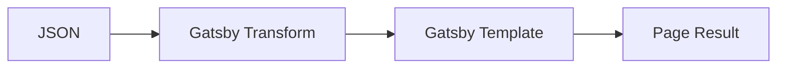

## Story

In the latest iteration of building my portfolio I end up trying a few different approaches. I started using MDX which lets you embed React components into Markdown files. This is a really cool concept but my use case ended up poor match. It was necessary that my projects followed a consistent structure for a more enjoyable and consistent experience. I decided on the following model;



This structure met the needs of;

- consistency
- scalability
- styling

The JSON and Gatsby template ensured that each project page followed the same content template. While, the template page allowed for whatever layout and styling I wanted. Finally, the JSON allowed for the scalability of many projects by easily adding a new project object to the JSON array.

## Prerequisites

Familiarity with Gatsby building pages in `gatsby-node.js` and general web development concepts such as using JSON.

## Set up

### Init Site

```shell
gatsby new json-demo https://github.com/gatsbyjs/gatsby-starter-default
```

Make sure everything is working `cd json-demo` & `gatsby develop`

open `http://localhost:8000` and `http://localhost:8000/___graphql`

### Add Data

In the `src/` add a `data/`. This is just a convention to keep the project organized. Within the `data/` add your JSON file, something like `data/data.json`.

```shell
mkdir src/data
```

```shell
touch src/data/myJsonData.json
```

If you want to generate some dummy day [Mockaroo](https://www.mockaroo.com/) is a nice resource to make custom data sets and Json is one of the forms.

### Configuring Gatsby to work with JSON

To set up Gatsby to work with JSON we `npm install`, `gatsby-source-filesystem`, `gatsby-transformer-json`. This will enable us to make Graphql queries to our JSON data.

**Gatsby JSON Packages**

```shell
npm install --save gatsby-source-filesystem gatsby-transformer-json
```

_gatsby-config.js_

```javascript
module.exports = {
  /*....*/
  plugins: [
    {
      resolve: `gatsby-source-filesystem`,
      options: {
        name: `data`,
        path: `${__dirname}/src/data/`,
        plugins: [`gatsby-transformer-json`],
      },
    },
  ],
}
```

Before moving forward it is useful at this point see how everything we just did is coming together run `Gatsby Develop` and open `http://localhost:8000/___graphql`

In the GraphQL "Explorer" we will see a new field called `allMyJsonDataJson` opening this up we have access to all of the keys in our data. At this point we might as well use the explore to mock out our query for the next step.

## Create Pages on Build

Now that we have our data and we know Gatsby sees it. We are going to create our pages and to do this Gatsby needs a page template.

### Create Page Template

```shell
mkdir src/templates
```

```shell
touch src/templates/jsonTemplate.js
```

_jsonTemplate.js_

```javascript
import React from 'react'
import Layout from '../components/layout'

export default function Template({ pageContext }) {
  const page = pageContext.page.node
  return (
    <Layout>
      <div className="">
        <h2 className="">{page.title}</h2>
        <h4 className="">{page.description}</h4>
        <div className="">{page.content}</div>
      </div>
    </Layout>
  )
}
```

_gatsby-node.js_

```javascript
const path = require(`path`)
const { createFilePath } = require(`gatsby-source-filesystem`)

// create pages from json
exports.createPages = async ({
  actions: { createPage },
  reporter,
  graphql,
}) => {
  const result = await graphql(`
    {
      allMyJsonDataJson {
        edges {
          node {
            id
            description
            title
            content
            date_created
          }
        }
      }
    }
  `)

  const pages = result.data.allMyJsonDataJson.edges

  pages.forEach((page, index) => {
    let slug = page.node.title
    slug = slug.replace(/[^a-z0-9+]+/gi, '-').toLowerCase()
    createPage({
      path: `/${slug}/`,
      component: require.resolve('./src/templates/jsonTemplate.js'),
      context: { page },
    })
  })
}
```

handle images sources called out in JSON `gatsby-transformer-remark`, `gatsby-image`, `gatsby-plugin-sharp`, `gatsby-transformer-sharp`, `gatsby-transformer-remark`

**Gatsby Image Packages**

```shell
npm install --save gatsby-image gatsby-plugin-sharp gatsby-transformer-sharp
```
